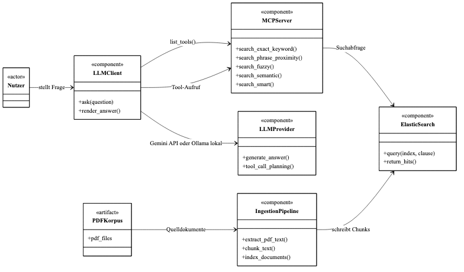
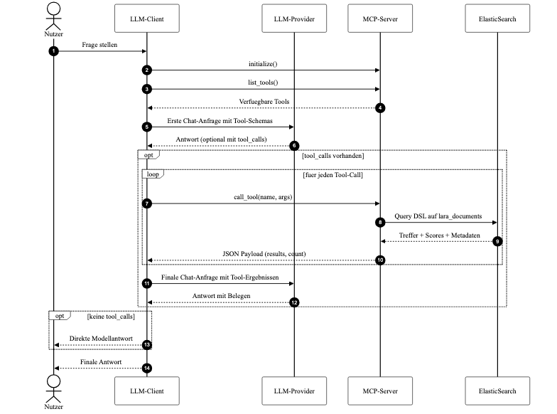
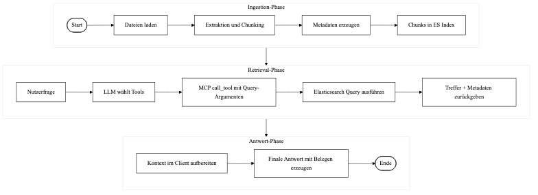

# Einleitung

Im Kontext generativer künstlicher Intelligenz (KI) nimmt das Thema Datenschutz und Privatsphäre ein prominentes Thema ein. Neben dem Schutz personenbezogener Daten, ist im Kontext lernender Large Language Models (LLMs) insbesondere auch die Achtung von Rechten an geistigem Eigentum gemeint.

## Problemstellung und Motivation

Für viele Daten und Dateien, sowohl im privatwirtschaftlichen Kontext, als auch besonders in der Forschung, scheidet eine Speicherung in der Cloud oder gar die Übertragung an externe LLM-Dienstleister aus. Das kann zur Wahrung des Geschäftsgeheimnisses dienen oder bei Dokumenten wie wissenschaftlichen Artikeln, Abhandlungen und Lehrbüchern aus lizenzrechtlichen Gründen untersagt sein.

Dennoch kann insbesondere in der Forschung ein großer Nutzen aus der Abfrage bestehender Wissensbestände mittels KI-Assistent gezogen werden. Dieses Projekt erforscht eine Möglichkeit, dieses Bedürfnis in Konformität mit Lizenzbestimmungen lokal umzusetzen, ohne dass die zu durchsuchenden Dokumente selbst Teil des Prompts sind.

Alle Dateien mittels eins lokalen LLMs zu indizieren und als Kontext zu verwenden, ist für umfangreiche Datenmengen mit herkömmlichen Rechnern aufgrund der entstehenden Wartezeiten unwirtschaftlich. Daher wird eine hybride Lösung mit ElasticSearch als Suchprovider untersucht.

## Zielsetzung und Forschungsfrage

Ziel der Arbeit ist die Entwicklung eines Prototypen, der gemäß der Problemstellung einen lokal operierenden Chatbot implementiert. Dieser soll mittels Model Context Protocol auf einen ElasticSearch Server zugreifen, um Fragen des Nutzers wahrheitsgemäß und fundiert beantworten und mit Textstellen belegen zu können. Zu Zwecken des prototypischen Entwicklung wird ein externes Modell verwendet, um den Test- und Iterationsprozess zu beschleunigen. Der Prototyp muss per Anforderung aber auch lokal ausgeführt werden können.

Es soll im Anschluss ermittelt werden, wie akkurat die Retrievalarchitektur auf vorhandene Textstellen zurückgreift und ob die Interpretation durch das LLM zu einer sinnvollen und korrekten Beantwortung der Frage führt. Hierzu wird die Genauigkeit anhand von Precision- und Recall Metriken untersucht und zusammen mit einer manuellen Bewertung der LLM-Antwort dargestellt. Der Fokus liegt hierbei auf der Korrektheit der finalen Antwort, sowie dem Vergleich verschiedener Suchansätze untereinander.

Daraus ergibt sich die folgende Forschungsfrage: *Kann ElasticSearch via Model Context Protocol als Grundlage für einen KI-gestützten, lokalen Dokumentzugriff dienen?*

## Aufbau der Arbeit

Nach der Einleitung und Beschreibung der Zielsetzung im ersten Kapitel, wird im zweiten Kapitel zunächst eine einheitliche Verständnisgrundlage für das Thema Retrieval-Augmented Generation (RAG) und Agentic-RAG geschaffen. Dafür ist es notwendig, das Konzept Model Context Protocol und die Technik ElasticSearch einzuordnen. Das dritte Kapitel behandelt die Anforderungsanalyse und legt die Zielarchitektur schematisch dar. Kapitel vier befasst sich anschließend mit der Implementation des Prototypen und beleuchtet Herausforderungen und Probleme, die im Laufe des Prozesses aufgetreten sind. Das fünfte Kapitel behandelt die verschiedenen verwendeten Retrieval-Strategien und bildet damit die Basis für Kapitel sechs, in dem die verwendete Testbench und das zugrundeliegende Evaluationsdesign beschrieben werden. Im siebten Kapitel werden die experimentellen Messergebnisse dargelegt und erläutert, bevor sich die letzten beiden Kapitel mit der Einordnung der erzielten Ergebnisse und dem Fazit des Softwareprojekts widmen.

# Technische und fachliche Grundlagen

Als Basis für die folgende Implementation, Analyse und Diskussion wird in diesem Kapitel eine Einordnung der zugrundeliegenden Konzepte und Technologien vorgenommen.

## Retrieval-Augmented Generation und Agentic-RAG

Die Retrieval-Augmented Generation (RAG), versteht sich als eine Erweiterung künstlicher Intelligenz in Form von LLMs um die Fähigkeit Datenmengen außerhalb des Kontext zu durchsuchen und daraus Antworten zu generieren. Dabei ist es unwichtig, woher die Daten stammen, Datenbanken sind ebenso wie die im folgenden verwendete Dokumentensammlung im Rahmen der Definition möglich. Entscheidender Vorteil dieses Verfahrens zur herkömmlichen Generativen KI ist, dass Wissen abgerufen werden kann, welches nicht als Teil eines Trainingssets im LLM selbst vorhanden ist, sondern aus den externen Quellen stammt [@honroth2024rag]. Das LLM trägt die gefunden Testpassagen im Anschluss zusammen und transformiert das Wissen im Sinne des Prompts. Solche Systeme werden häufig als RAG AI bezeichnet [@honroth2024rag].

Durch RAG ergänzte LLMs überbieten herkömmliche generative KI dabei in Spezifizität, Diversität und Genauigkeit [@lewis2020rag] und tragen zur Vermeidung von Halluzination, also der eigenmächtigen Generierung erfundener Tatsachen durch die KI bei [@ji2023hallucination]. Die *dependability* des Modells steigt unter diesen Gesichtspunkten enorm. Als dependability zusammengefasst werden die Eigenschaften der Verfügbarkeit, der Zuverlässigkeit, Wartbarkeit, Zugriffssicherheit (security), und der funktionalen Sicherheit (safety) im Sinne der Vermeidung schwerwiegender Konsequenzen als Resultat fehlerhafter Antworten [@fraunhoferDependableAI2026]. 

Eine RAG-Architektur kann in drei Hauptkomponenten zerlegt werden: Abruf, Augmentation und Generierung [@singh2025agentic]. Ersteres ist dabei für die Bereitstellung relevanter Daten durch Durchsuchen des externen Informationssystem verantwortlich. Die Augmentationskomponente bereite diese anschließend auf, indem Informationen im Kontext der Prompt zusammengefasst werden. Die Generierung nutzt abschließend das LLM, um fundierte Antworten im Sinne der Anfrage zu generieren. 

![Funktionsweise von RAG AI (eigene Darstellung, nach [@honroth2024ragInfographic])](assets/img/rag.png)

Jedes moderne und hinreichend große LLM kann mit RAG ausgestattet werden, um auf Grundlage von LLM externen Datenmengen zu antworten. Eigenes, dem LLM-Kontext fernes, Wissen kann so genutzt werden, ohne das LLM selbst neu zu trainieren oder fine-tuning zu betreiben [@honroth2024rag].

Trotz der genannten Vorteile sind RAG AI Systeme durch den statischen Wissenskern des vortrainierten Modells eingeschränkt. Zwar sind sie im Vergleich zu regulären LLMs überlegen, aber dennoch nicht immun gegen Halluzination und durch veraltete Trainingsdaten verfälschte Antworten [@ji2023hallucination].

Neben der Erweiterung des LLMs um externe Wissensquellen, besteht der Bedarf das monolithische System, um externe Mechanismen zur Entscheidungsfindung und Kontrolle zu erweitern. Dieses Konzept ist als Agentic Intelligence bekannt und beschreibt die Fähigkeit eines KI-Systems, mehrstufige Aufgaben zu bewältigen. Dies geschieht, indem, möglicherweise verschiedene, LLMs in Form von Software-Agenten kooperieren. Dadurch kann zum einen autonom geplant werden, zum anderen können auch im Laufe des Prozesse Entscheidungen getroffen und nach eigenem ermessen auf externe Werkzeuge zugegriffen werden [@mitSloan2025agentic].

In Kombination mit einer *RAG-Architektur* bildet eine *Agentic AI* ein *Agentic RAG*, indem autonome KI-Agenten in die RAG-Pipeline eingesetz werden, um durch die Kombination aus Planung, Tool-Nutzung, Reflexion und der Zusammenarbeit mehrerer Agenten das RAG-System und die Suchstrategien vollkommen dynamisch zu steuern. Dies erzeugt eine einzigartige Flexibilität der Arbeitsabläufe. Daraus resultiert, dass Agentic RAG-Systeme in der Praxis eine unübertroffene Flexibilität, Skalierbarkeit und ein noch tieferes Kontextverständnis liefern [@singh2025agentic].

## ElasticSearch als lokale Retrieval-Komponente

Während Architekturen für RAG zur Durchsuchung von Dokumentensammlungen häufig auf semantischen Vektorsuchen basieren, wirkt im vorliegenden Anwendungsfall eine unscharfe (fuzzy) String-Suche zielführender. Deshalb wird im folgenden auf ElasticSearch zurückgegriffen. Für diese Entscheidung sprechen mehrere technische und konzeptionelle Gründe.
ElasticSearch ist als quelloffene, verteilte Such- und Analytics-Engine, die gezielt auf Geschwindigkeit und Skalierbarkeit ausgelegt ist, hervorragend für den Einsatz in KI-Anwendungen geeignet.

Die eigentliche Suchfunktionalität von ElasticSearch basiert dabei auf Lucene, einer in Java geschriebenen Programmbibliothek der Apache Software Foundation. Ziel der Bibliothek ist die Bereitstellung einer leistungsfähigen Volltextsuche, die es erlaubt, aus einem frei formulierten Text eine Trefferliste zu erzeugen. Dabei ist Lucene in der Lage, mit fehlerhaften Schreibweisen, Synonymen und Formulierungen sowie grammatikalischen Formen, wie Singular und Plural, umzugehen. Gesuchte Begriffe werden zuverlässig in Texten identifiziert [@elasticFullText2026]. Der Vorteil einer solchen Freitextsuche liegt in der Fähigkeit, dem Nutzer auch bei ungenauer oder fehlerhafter Eingabe ein passendes Suchergebnis bereitzustellen, was für die verwendete fuzzy Suche von zentraler Bedeutung ist [@elasticFullText2026].

Die aus den Quelldaten erzeugte Vektordatenbank speichert mühelos große Mengen an halbstrukturierten Daten als schemalose JSON-Dokumente [@elasticVectorDatabase2026] und ermöglicht Sprachmodellen so den Zugriff auf lokale Informationen, ohne dass das Modell selbst die Quelle verarbeiten muss [@elasticVectorDatabase2026]. So gelingt das Retrieval in Echtzeit.
Selbst bei umfangreichen Datenbeständen liefert die Suche innerhalb von Millisekunden deterministische Ergebnisse die dem Sprachmodell mit präzisen Kontextinformationen, wie beispielsweise die Quelldatei und die Zeilennummer, bereitgestellt werden [@elasticVectorDatabase2026]. Zum anderen erlaubt ElasticSearch eine hybride Suche, die die klassische Volltextsuche mit dichten und dünn besetzten Vektoreinbettungen (Dense und Sparse Vectors) kombiniert und so ein hohes semantisches Verständnis erreicht [@elasticHybridSearch2026]. Während der ingestion wandelt dafür ein spezielles Embedding-Modell die Texte in hochdimensionale Zahlenvektoren um. Ein vector wird dabei *dense* genannt, wenn nahezu jede Dimension einen von null verschiedenen Wert enthält. Ist er dagegen dünn besetzt, das heißt die meisten Dimensionen sind null und nur wenige tragen Information, bezeichnet man ihn als *sparse*. Die *Cosine Similarity* beschreibt schließlich als Funktion die Ähnlichkeit zweier Vektoren über den Winkel zwischen ihnen und ist auf den Wertebereich von -1 bis 1 normiert. Je naeher der Wert an 1 liegt, desto ähnlicher sind die verglichenen Inhalte [@elasticHybridSearch2026].

So kann die RAG-Pipeline direkt innerhalb des Elastic-Ökosystems umgesetzt werden, ohne dass zusätzliche externe Werkzeuge wie LangChain zwingend erforderlich wären [@elasticProduct2026].

## Model Context Protocol als Werkzeugschicht für LLM-Systeme

Um im Rahmen einer RAG-Architektur auf die fehlertolerante Suchoperation über die externen Datenquellen zugreifen zu können, die mit ElasticSearch in Form der Retrieval-Komponente bereitgestellt wird, ist eine übergeordnete Struktur nötig. Diese muss die Interaktion zwischen dem Sprachmodell und ElasticSearch sowohl koordinieren als auch standartisieren.

Herkömmliche Integrationsschnittstellen wie klassische REST- oder fixed-schema RPC-APIs stoßen hierbei an systemische Grenzen. Sie agieren prinzipiell zustandslos und unterstützen keine native Sitzungshistorie, weshalb ihre starren Verträge den dynamischen Anforderungen moderner KI-Systeme nicht gerecht  werden [@ray2025mcp]. Diese technologische Lücke schließt das von Anthropic entwickelte Model Context Protocol (MCP) als eine universelle Ebene, die als sitzungsorientiertes Framework die Integration von Werkzeugen, Prompts und Kontexten in LLMs vereinheitlicht [@sanikommu2025mcp; @ray2025mcp].

Das MCP basiert architektonisch auf einem modularen Host-Client-Server-Paradigma und gewährleistet so eine strikte Funktionstrennung sowie die isolationstechnische Absicherung einzelner Systemkomponenten, indem der MCP Host als zentrale, vertrauenswürdige Instanz agiert [@ray2025mcp]. Dieser steuert den Lebenszyklus von Client-Instanzen und überwacht Sicherheitsrichtlinien sowie Benutzergenehmigungen via OAuth 2.1 und koordiniert die Kontextaggregation aus verschiedenen Quellen. Die MCP Clients sind so isoliert voneinander und halten dedizierte Punkt-zu-Punkt-Verbindungen zu den jeweiligen Servern [@ray2025mcp].
Auf Protkollebene erfolgt der Nachrichtenaustausch über das minimalistische JSON-RPC 2.0-Protokoll. Als Transportschichten dienen entweder standard input/output (stdio) für lokale Subprozesse oder Streamable HTTP mit Server-Sent Events (SSE) für cloud-native Netzwerkumgebungen [@ray2025mcp].

Um Services bereitzustellen, exponieren die MCP Server spezifische Fähigkeiten über vier standardisierte Primitive nach außen [@ray2025mcp]:

1. Prompts: Vordefinierte, benutzergesteuerte Eingabetemplates werden dynamisch über Argumente parametrisiert, um das Modellverhalten zu steuern [@ray2025mcp].

2. Resources: Anwendungsgesteuerte Datenkomponenten, die über eindeutige Uniform Resource Identifiers (URIs) identifiziert werden. Sie stellen strukturierte oder unstrukturierte Kontexte wie Text- oder Binärdaten bereit [@ray2025mcp].

3. Tools: Modellgesteuerte, ausführbare Funktionen oder Remote-APIs, die mit JSON-Schema-basierten Parametern definiert sind und LLMs die autonome Ausführung von Aktionen in externen Systeme erlauben [@ray2025mcp].

4. Utilities: Querschnittsfunktionen wie zum Beispiel standardisiertes Logging nach dem Syslog-Standard (RFC 5424), Argumentvervollständigungen und Cursor-basierte Paginierungsmechanismen zur Optimierung der Wartbarkeit [@ray2025mcp].

Durch dieses strukturierte Zusammenspiel befähigte MCP LLM-Systeme können kontextuelle Datenströme in Echtzeit verarbeiten [@sanikommu2025mcp]. Mittels intelligenter Filterung, hierarchischer Repräsentationen und progressiver Ladetechniken können kritische Limitierungen wie der Zustand des Context Overload oder hardwareseitige Token-Fenster-Beschränkungen effektiv kompensiert werden [@sanikommu2025mcp].

Das Protokoll fungiert folglich als eine Art universelle Werkzeugschicht, vergleichbar mit einem „USB-C-Standard für KI-Anwendungen“ [@ray2025mcp].

## PDF-Ingestion, Chunking und Metadaten

Das Fundament unstrukturierter Datenbestände bildet die Verarbeitung moderner Architekturen zur wissensbasierten Textgenerierung. Im Zentrum dieser Vorbereitung steht die sogenannte Ingestion, deren primäres Ziel es ist, heterogene Dokumente wie lokale PDF-Bestände, oft rekursiv, so aufzubereiten, dass sie präzise durchsuchbar und zitierbar werden [@gao2024ragllm].

Der kritische Teilschritt innerhalb dieser Pipeline ist die Extraktion des Rohtextes und dessen Zerlegung in kleinere, semantische Einheiten (chunks). Diese Aufteilung ist notwendig, um sicherzustellen, dass die Treffer klein genug für präzises Retrieval bleiben [@barnett2024failurepoints]. Das Chunking wird dabei als konfigurierbares Systemelement verstanden: Die Parameter der Chunk-Größe (Chunk Size) und des Überlappungsbereichs (Overlap) müssen so gewählt werden, das eine Balance zwischen der Kontextqualität und der Treffergenauigkeit gewährleistet wird [@gao2024ragllm].

Für die spätere Nachvollziehbarkeit und Evaluierung ist es zudem unerlässlich, pro Chunk einen persistenten Satz an strukturierten Metadaten zu speichern. Dieser Datensatz umfasst wenigstens Identifikatoren wie die doc_id und chunk_id sowie inhaltliche Orientierungspunkte wie den Dokumententitel, den Datei- bzw. Quellpfad, die konkrete Seite und den extrahierten Textinhalt. Insbesondere die exakten Seitenmetadaten sind für die spätere Belegstellenprüfung und das manuelle Review von fundamentaler Bedeutung [@manning2008informationretrieval].

Als strukturierte Ablage dieser Chunks und ihrer Metadaten dient ein invertierter Index, wie er in modernen Suchmaschinen-Architekturen wie ElasticSearch realisiert ist. Ein solcher Index bildet die informationstechnische Grundlage, um komplexe Such- und Retrieval-Strategien performant auszuführen [@manning2008informationretrieval].

## Evaluationsmetriken für Retrieval und Antwortqualität

Die Validierung eines kombinierten Such- und Generierungssystems erfordert eine strikte Trennung zwischen der Leistungsfähigkeit des Suchverfahrens (Retrieval-Qualität) und der Performanz des nachgelagerten Sprachmodells (Antwortqualität) [@es2025ragas]. Beide Komponenten agieren auf unterschiedlichen Ebenen und müssen mit verschiedenen, passenden Instrumenten gemessen werden.

Das Retrieval, also die reine Informationsbeschaffung, wird klassisch über die informationstheoretischen Standardmetriken Präzision (Precision@k) und Sensitivität (Recall@k) bewertet, ergänzt durch die Trefferquote (Hit-Rate) bei einem definierten Schwellenwert k [@manning2008informationretrieval].
Bei der Evaluation dünn besetzter oder sparsamer Treffermengen ist es wichtig, nicht nur zu erfassen, ob ein relevantes Dokument gefunden wurde, sondern auch in welchem Verhältnis die relevanten Treffer zur gesamten Menge an gelieferten Resultaten stehen. Um eine Verzerrung der Evaluationsergebnisse durch extreme Ausreißer in beide Richtungen zu verhindern, müssen die gefunden Werte über die Gesamtheit aller Testfragen gemittelt werden. Dies wird als Macro-Aggregation bezeichnet [@manning2008informationretrieval].
Konzeptionell sollte sich eine solche Evaluation zudem über verschiedene operative Modi erstrecken – von kontrollierten Nutzeranfragen (user) über realistische Parameterkonfigurationen (realistic_args) bis hin zu erweiterten Diagnoseeinstellungen (diagnostic_args), um das Systemverhalten unter variierenden Randbedingungen zu analysieren.
Die methodische Basis für diese quantitative Überprüfung bildet das sogenannte Goldtruth-Konzept. Hierbei wird jeder Testfrage vorab manuell eine Menge erwarteter Chunk-IDs oder relevante Belegstellen zugewiesen. Für die Retrieval-Stufe ist dann entscheidend, ob diese erwarteten Ziel-Chunks in den Suchergebnisse auftauchen [@craswell2020overviewtrec].

Für die finale Antwortgenerierung hingegen ist entscheidend, ob das LLM die bereitgestellten Treffer syntaktisch und semantisch korrekt verarbeitet.
Da automatisierte textuelle Metriken die Nuancen natürlicher Sprache nicht ausreichend abbilden, muss die Evaluation um eine manuelle Bewertung der Antwortqualität erweitert werden [@es2025ragas]. Diese qualitative Überprüfung erfolgt anhand formaler Kriterien wie der sachlichen Korrektheit, der inhaltlichen Vollständigkeit und der logischen Widerspruchsfreiheit der Antwort. Die Ergebnisse dieser Bewertung werden idealerweise in einem mathematisch gewichteten Antwortscore zusammengefasst. Dieser erlaubt es anschließend, verschiedene algorithmische Suchstrategien direkt miteinander zu vergleichen. Methodisch wertvoll ist hierbei auch die separate Ausweisung von sogenannten Zero-Hit-Fällen (Suchen, die keinerlei Ergebnisse liefern), da diese bei der Interpretation der Systemleistung grundlegend anders zu bewerten sind als eine lediglich suboptimale Rangfolge (Ranking) der Treffer [@barnett2024failurepoints].

Abschließend ist die Erkenntnis zentral, dass hervorragende Retrieval-Metriken nicht automatisch eine hohe Antwortqualität garantieren [@es2025ragas; @lewis2020rag]. Wenn das LLM an der Interpretation der Suchergebnisse scheitert oder in Halluzination verfällt, führen selbst perfekte Retrieval-Werte zu einem fehlerhaften Ergebnis. Aus diesem Grund müssen zu einer ganzheitlichen Evaluation des Systems immer beide Metriken betrachtet werden.


# Anforderungsanalyse und Zielarchitektur

Nach Klärung der Grundbegriffe, werden in diesem Kapitel die fachlichen und technischen Anforderungen an den zu entwickelnden Prototypen herausgearbeitet. 

Der erwartete Anwendungsfall ist die fachlich korrekte Beantwortung von Nutzerfragen über Nischenwissen aus einem lokalen Dokumentbestand (möglicherweise) sensibler oder geschützter Dateien. Daraus lassen sich zwei Leitprinzipien ableiten. Einerseits muss das System ohne Cloud-Speicherung der Quelldaten betrieben werden können, andererseits muss jede Antwort explizit auf konkreten Textstellen basieren, damit die fachliche Korrektheit gewahrt bleibt.

Die Interaktion soll einem werkzeug-gestützten Agentic-RAG-Muster folgen. Das LLM entscheidet anhand der Frage, welches Retrieval-Tool geeignet ist, lässt Treffer abrufen und verdichtet diese zu einer Antwort.

## Funktionale Anforderungen

1. Das System muss PDF-Dokumente aus einem lokalen Verzeichnis verarbeiten, in Chunks aufteilen und inklusive Metadaten indexieren.

2. Das Retrieval muss zu Vergleichszwecken mehrere Strategien unterstützen und als Tool über MCP exponieren.

3. Das LLM muss Retrieval-Tools bedarfsgerecht aufrufen, Treffer konsolidieren und eine fundierte Antwort erzeugen.

4. Für reproduzierbare Experimente muss die Testbench verschiedene Modi und vergleichbare Runs unterstützen.

5. Retrieval- und Antwortqualität müssen getrennt evaluierbar sein, um zwischen Tool und LLM als Fehlerquelle unterscheiden zu können.

6. Die Inhalte der indexierten Dokumente verbleiben lokal, es darf zu Testzwecken eine optionale externe Modellanbindung existieren.

7. Um auf Entwicklungen der Branche reagieren zu können, müssen neue Retrieval-Tools ohne Änderung des Gesamtprotokolls integrierbar sein.

8. Tippfehler und variierende Begriffswahl innerhalb der Suchanfrage müssen dennoch zu relevante Ergebnissen führen.

9. Zu Zwecken der Wartbarkeit müssen die Komponenten der RAG-Pipeline klar getrennt sein.

## Zielarchitektur des Systems

Die Zielarchitektur ist in vier Schichten aufgeteilt: Datenbasis (PDF-Dateien), Retrieval-Layer (ElasticSearch), Tool-Layer (MCP) und Client-Layer (LLM Chatbot in der Konsole). Die Ingestion-Pipeline extrahiert und segmentiert PDF-Inhalte einmalig und schreibt diese mit Metadaten in den ElasticSearch-Index. Der MCP-Server stellt darauf aufbauend Suchfunktionen als standardisierte Tools bereit. Der Client-Agent verbindet diese Tools mit dem Sprachmodell und orchestriert den Antwortprozess.



Die operative Sequenz beginnt mit der Nutzerfrage im Client. Das LLM wählt anschließend ein oder mehrere Retrieval-Tools. Der MCP-Server überführt den Tool-Aufruf in eine ElasticSearch-Abfrage und liefert im Anschluss Treffer mit Metadaten zurück. Auf dieser Grundlage erzeugt das LLM die finale, belegte Antwort. Damit werden sowohl fachliche Korrektheit als auch Transparenz des Antwortwegs abgesichert.




# Systementwurf, Implementierung und Entwicklung der Retrieval-Strategien

Auf die technischen Anforderung aus vorherigen Kapitel aufbauend, wird in diesem Kapitel die finale Version des Prototypen detailliert beschrieben. Es wird die Iterationshistorie erläutert, zudem werden aufgetretene Probleme und deren Lösungen beleuchtet. 

## Gesamtpipeline vom PDF-Dokument bis zur Antwort

In der ersten Iteration des Prototypen unterstützte dieser nur ein eine einzelne PDF-Datei mit exakter Keyword Suche als einziger Retrieval Strategie. Im Verlauf der Entwicklung entwickelte sich die Architektur iterativ weiter. Auf rekursive Ingestion folgten neue Suchstrategien und deren Verbesserung, sodass das geforderte Format einer typischen RAG-Pipeline erreicht werden konnte. Diese sieht gegenwärtig wie folgt aus:



Neben den vier theoretischen Schichten ist die Pipeline sinnvoll in drei praktische Schritte zu unterteilen. Der erste Schritt besteht in der Ingestion der Quelldaten, der Transformation der Quelldaten in die Datenbank der Retrieval-Schicht.

Der relevante Code für diesen Schritt ist in erster Linie im Modul `ingestion` zu finden. Im Gegensatz zu den folgenden beiden Modulen, muss die Ingestion nicht für jeden Prompt des Nutzers neu ausgeführt werden. Es reicht, den Prozess einmal vor Eingabe der ersten Frage anzustoßen. Die errechneten Chunks, Metadaten und Vektoren sind persistent im Ordner `lara_documents` gespeichert. Lediglich eine Änderung an den Quelldaten macht ein erneutes Durchführen dieses Schritts nötig.

Sobald die Quelldaten verarbeitet sind, kann der Nutzer über den Client, dessen Quellcode in `mcp-client` zu finden ist, den zweiten Schritt, Retrieval, anstoßen. Das vom Client angefragte LLM wählt ein Retrieval-Tool aus, das vom MCP-Server (zu finden in `mcp-server`) als standardisierte Schnittstelle bereitgestellt wird. Mit diesem Tool wird der containerisierte ElasticSearch-Server angefragt, auf dem die Query verarbeitet wird.

Das Resultat der ES-Query stößt schließlich den dritten Schritt an, indem das Query an den Client zurückgegeben wird. Dort wertet das LLM das Suchergebnis aus und formuliert dieses zu einer Antwort. Der Client fungiert innerhalb der Schritte zwei und drei durchgehend als Orchestrator und bestimmt, was zu welcher Zeit passiert.

## Dateningestion und Indexaufbau

Die Ingestion ist so aufgebaut, dass sie nicht nur einzelne Dateien verarbeitet, sondern den gesamten lokalen PDF-Ordner rekursiv einliest. Damit eignet sich die Pipeline insbesondere auch für wachsende Datensammlungen. Ohne, dass das Skript neu angepasst werden muss, ist der Prozess über Parameter steuerbar. Derselbe Code kann sowohl für schnelle Erweiterung als auch für vollständige Re-Indexierungen genutzt werden.

Inhaltlich relevante Textfelder (`title`, `content`) werden mit dem Analyzer `german` indexiert, damit sprachspezifische Normalisierung bei der lexikalischen Suche berücksichtigt wird. Zentral für die spätere Retrieval-Qualität ist dabei das Chunking. Die Texte werden in kleinere Einheiten zerlegt, damit Elasticsearch später präzise Treffer zurückgeben kann und der Kontext für das LLM nicht zu grob wird. Die erzeugten Chunks werden zusammen mit stabilen Metadaten wie `doc_id`, `chunk_id`, `page` und `file_path` gespeichert. Diese Felder sind im weiteren Verlauf entscheidend für die Evaluation.

Die Parameter für Chunkgröße und Overlap haben sich im Entwicklungsverlauf mehrfach geändert. In den Iterationen hat sich diese, neben der Wahl der Retrieval-Strategie, als größter Hebel für Retrieval-Präzision erwiesen. Kleine Chunks führten zwar zu hoher Granularität, aber häufiger zu Kontextverlust über Satz- und Abschnittsgrenzen hinweg, sodass zwar die erwarten Chunks gefunden wurden, dass LLM an mangels Kontext an der Interpretation scheiterte. Große Chunks verbesserten dagegen den lokalen Zusammenhang, reduzierten jedoch die Trennschärfe der Treffer und erhöhten die Menge irrelevanter Beitexte in der späteren Antwortgenerierung, sodass das LLM eine unpräzise Antwort lieferte. Ein analoger Trade-off zeigte sich ebenfalls beim Overlap. Ein zu geringer Überlappungsbereich begünstigt harte Informationsabbrüche an Chunkgrenzen, sodass dem LLM wieder der Kontext fehlt, um ausführlich zu antworten. Wird der Overlap zu hoch gewählt, erzeugt dieser unnötige Redundanz, größere Indexmengen und teilweise doppelte Evidenzen in den Top-Treffern, was seitens des LLM zu einer falschen Gewichtung der erhaltenen Informationen führte.

Im finalen Stand wurde daher die Konfiguration `chunk-size=1100` und `chunk-overlap=180` gewählt. Die Einstellung erwies sich für den verwendeten Dokumenttyp als robuster Kompromiss zwischen semantischem Zusammenhang und ausreichender Grenzstabilität, sowie wirtschaftlicher Größe.


```python
#ingestion/ingest.py
documents: list[dict] = []
for page_data in md_pages:
    page_num = get_page_number(page_data)
    text = str(page_data.get("text", "")) if isinstance(page_data, dict) else ""
    chunks = text_splitter.split_text(text)

    for chunk_index, chunk in enumerate(chunks):
        clean_chunk = chunk.strip()
        if not clean_chunk:
            continue

        chunk_id = f"{doc_id}_p{page_num}_c{chunk_index:03d}"
        documents.append(
            {
                "_index": index_name,
                "_source": {
                    "doc_id": doc_id,
                    "chunk_id": chunk_id,
                    "title": title,
                    "source": doc_id,
                    "page": page_num,
                    "file_path": file_path,
                    "content": clean_chunk,
                },
            }
        )
```

Als optionale Funktion der Ingestion ist die Vektorerstellung implementiert. Sie wird durch den Flag `--enable-vectors` aktiviert. Dadurch bleibt die Pipeline für reine lexikale Experimente schlank, kann aber für semantische oder hybride Retrieval-Varianten erweitert werden, ohne den Datenfluss zu verändern.

Technisch wird dafür ein eigener `OllamaEmbedder` verwendet, der pro Chunk einen HTTP-Request an die lokale Embedding-API stellt und das Ergebnis als numerischen Vektor zurückliefert. Von besonderer Relevanz ist dabei die Dimensionskontrolle. Wenn der Flag `--embedding-dims` größer als 0 gesetzt ist, wird jede Embedding-Antwort gegen diese feste Dimension validiert. Falls `--embedding-dims` auf 0 bleibt, ermittelt die Pipeline die Dimension zu Beginn über einen Probeaufruf und übernimmt diesen Wert anschließend konsistent für Mapping und Ingestion. Letzteres wurde im Folgenden eingesetzt.

Während der oben beschriebenen Verarbeitung wird der Vektor, sollte die Erstellung aktiviert sein, direkt als `dense_vector` an das jeweilige Chunk-Dokument angehangen (`content_vector`). Die Ähnlichkeitsberechnung erfolgt über Cosine Similarity.

```python
#ingestion/ingest.py
if args.enable_vectors:
    embedder = OllamaEmbedder(
        api_url=args.embedding_api_url,
        model=args.embedding_model,
        timeout_seconds=args.embedding_timeout,
        expected_dims=embedding_dims,
    )
    if embedding_dims <= 0:
        print("Bestimme Embedding-Dimensionen ueber Probe...")
        embedding_dims = embedder.probe_dimensions()
        embedder.expected_dims = embedding_dims
        print(f"  -> Erkannte Embedding-Dimension: {embedding_dims}")
```
```python
vector = embedder.encode(clean_chunk)
documents[-1]["_source"]["content_vector"] = vector
```

 Ist die Vektorfunktion aktiv, ergänzt die Pipeline jedes Dokument um `content_vector` als `dense_vector`; die Ähnlichkeitsberechnung erfolgt über Cosine Similarity. Damit sind im selben Index sowohl klassische textbasierte als auch semantische beziehungsweise hybride Retrieval-Strategien konsistent auf derselben Chunk-Basis möglich.

## MCP-Server und Such-Tools

Der MCP-Server ist mit dem offiziellen MCP-SDK als eigenständiges Modul aufgesetzt und bindet in erster Linie ElasticSearch ein. Die Implementierung besitzt dabei zwei Endpunkte, die angefragt werden können. `ListToolsRequestSchema` liefert dabei eine JSON-formatierte Auflistung der verfügbaren Suchmodi. Die Ausführung einer Suche, der eigentliche Tool-Call, erfolgt über `CallToolRequestSchema`. Zum aktuellen Stand des Prototypen werden die Suchstrategien `search_exact_keyword`, `search_phrase_proximity`, `search_fuzzy`, `search_smart` und `search_semantic` bereitgestellt. Ein Tool-Aufruf wird serverseitig validiert, in eine konkrete ElasticSearch-Query transformiert und als normalisiertes JSON-Ergebnis inklusive Metadaten (`chunk_id`, `doc_id`, `page`, `excerpt`) zurückgegeben.

Diese Struktur ist standart im MCP-Protokoll und liefert dem Client eine stabile, einheitliche Schnittstelle, während sich die Retrieval-Logik im Hintergrund ohne Kenntnis des Clients iterativ weiterentwickeln kann. Daraus resultierend übernimmt der Server nicht nur die reine Tool-Expose, sondern auch die Härtung der Retrieval-Pfade. Exact-Queries werden über Rewrite-Logik robuster gegen Formulierungsvarianten gemacht, der semantische Pfad besitzt bei Embedding-Problemen einen lexical fallback, und `search_smart` akzeptiert nur validierte Plaene oder fällt auf heuristische Planung zurück.

### Exact Retrieval und Query-Rewrite

Das Exact-Retrieval war die erste implementierte Suchstrategie und erwies sich im gegeben Anwendungsfall als brauchbar für das Nachschlagen spezieller Fachbegriffe, die in den Quelldaten sauber als solche definiert waren. Davon abgesehen stellte sich dieser Ansatz als fragil heraus. Insbesondere wurden Begriffe, die an verschiedenen Stellen im Dokumentkorpus unter Synonymen verwendet wurden, nicht gefunden.

In Teilen lies sich der Ansatz verbessern. Um das volle Potential von ElasticSearch auszuschöpfen, wurde ein MCP-serverseitiger Query-Rewrite eingeführt. Hier zeigte sich zum ersten Mal die Stärke des modularen Ansatzes und des MCP-Protokolls. Die Suchlogik konnte deutlich robuster gestaltet werden, ohne den Tool-Vertrag anzupassen. Der Client musste dafür nicht modifiziert werden.

Technisch bildet eine mehrstufige `should`-Query den Kern. Die Rohanfrage wird erst als `simple_query_string` mit niedrigem Boost ausgeführt. Rewrite-basierte Varianten, wie normalisierte Terme, OR-Varianten und phrase-nahe Abfragen werden anschließend ergänzt. Die wichtigsten Stellschrauben dieser Strategie sind `minimum_should_match`, die Wahl von `default_operator` (`and` oder `or`), sowie die Boost-Gewichte der einzelnen Query-Zweige.

### Fuzzy Retrieval als robuster Baseline-Ansatz

Nachdem gezeigt war, dass der Prototyp in seiner Grundfunktion läuft, wurde Fuzzy-Retrieval als zweite Strategie in den MCP-Server aufgenommen. Der Schritt ergab sich als direkte Reaktion auf die Grenzen der exakten Suche. Schon kleine Tippfehler, Schreibvarianten oder abweichende Formulierungen konnten bei dieser Suche relevante Treffer ausblenden. Fuzzy schließt genau diese Lücke und ist somit als als robuste Standardstrategie geeignet, insbesondere bei unsauberen Nutzeranfragen.

Im Code basiert die Strategie auf einer kombinierten Bool-Query mit mehreren `should`-Klauseln, die unterschiedliche Fehlertoleranzgrade besitzen. Dabei bildet `multi_match` mit `fuzziness: "AUTO"` und `operator: "and"` den präziseren Kern. Ein zusätzlicher `match`-Zweig mit `operator: "or"` ist breiter aufgestellt und stabilisiert das Ergebnis bei unvollständigen oder unpräzisen Formulierungen. Zusätzlich erweitert `match_phrase_prefix` den Zugriff auf präfix-basierte Teiltreffer. Die Mindestbedingung `minimum_should_match: 1` stellt sicher, dass bereits ein belastbarer Pfad für einen Treffer ausreicht.

Im Entwicklungsverlauf lagen die wichtigsten Hebel nicht in den Spezialregeln, sondern, wie bei der Exact-Version, in der Abstimmung der zentralen Parameter. Diese waren in diesem Fall `fuzziness`, `operator`, `prefix_length`, `max_expansions` sowie die jeweiligen `boost`-Gewichte der Zweige.  Je nach Abstimmung lässt sich zwischen Präzision und Robustheit verschieben. Ein zu aggressiver Fuzzy-Pfad erhöht die Treffer-Abdeckung auf Kosten höheren Rauschens. Ein strenger Pfad reduziert dieses, mindert jedoch die Fehlertoleranz, welche die Stärke dieser Herangehensweise sein soll. Die finale Konfiguration geht in keines der Extreme. Eine mittlere Balance hat sich als am vielversprechendsten etabliert.

```typescript
//mcp-server/index.ts
if (toolName === "search_fuzzy") {
    const query = String(args.query ?? "").trim();
    const size = clampSize(args.size);

    if (!query) {
        throw new Error("'query' ist fuer search_fuzzy erforderlich.");
    }

    const { hits } = await esClient.search({
        index: INDEX_NAME,
        body: {
            query: {
                bool: {
                    should: [
                        {
                            multi_match: {
                                query,
                                fields: ["content", "title^2"],
                                fuzziness: "AUTO",
                                operator: "and",
                                prefix_length: 1,
                            },
                        },
                        {
                            match: {
                                content: {
                                    query,
                                    fuzziness: "AUTO",
                                    operator: "or",
                                    boost: 0.7,
                                },
                            },
                        },
                        {
                            match_phrase_prefix: {
                                content: {
                                    query,
                                    max_expansions: 50,
                                    boost: 0.6,
                                },
                            },
                        },
                    ],
                    minimum_should_match: 1,
                },
            },
            size,
        },
    });
```

### Phrase-Proximity als Mittelweg

Als dritte Strategie wurde `search_phrase_proximity` hinzugefügt. Diese Strategie ist besonders für Fälle geeignet, in denen die Nähe zwischen Begriffen wichtiger ist als ein einzelnes Schlagwort. Der Ansatz sollte zum Beispiel stark sein, wenn ein Regelzusammenhang erst aus der Kombination zweier Terme entsteht oder eine feste Formulierung gesucht wird. 

In der Theorie ist Phrase-Proximity vor allem dann sinnvoll, wenn die reine Fuzzy-Suche zu breit wird und Exact zu eng bleibt. Es kann also als eine Art Mittelweg zwischen den beiden bestehenden Strategien verstanden werden. Justierbar ist die Strategie über die Einstellung `slop`. Ein kleiner Wert erzwingt hohe Wortnähe und erhöht Präzision, ein größerer Wert fängt Umstellungen und Zwischenwörter ab, erhöht aber zugleich das Risiko für weniger trennscharfe Treffer. Der Standart-Wert von `slop = 5` hat sich jedoch als gut erwiesen. Eine Anpassung lieferte keine Messbare Verbesserung.

### KI-gestütztes Smart Retrieval: Idee, Umsetzung und Grenzen

Die Retrieval-Strategie `search_smart` erweitert die Suche um einen vom LLM vorgeschlagenen, serverseitig validierten Suchplan mit Fallback-Mechanik. Dadurch werden Planungsflexibilität und operative Robustheit kombiniert: Der Client kann einen Plan vorschlagen, der Server behält jedoch die Kontrolle über Gültigkeit und Ausführung.

Der Unterschied zu den anderen Strategien liegt dann darin, dass es nicht eine festgelegte Suchmethode ist, sondern ein adaptives Meta-System. Statt eine einzelne, vordefinierte Retrieval-Logik zu wählen und auszuführen, kann das Client-LLM einen detaillierten Plan mit Keywords, Expansionen und Confidence-Scores vorschlagen. Der Server validiert den Plan und übernimmt dann die intelligente Orchestration, statt das LLM die Strategie raten zu lassen.

Dies ist konzeptionell ein Vorteil gegenüber Fällen, in denen das LLM extern bereits alle Strategien selbst wählt. `search_smart` reduziert die Verantwortung auf dem Client, da dieser nicht mehrfach experimentieren muss oder verschiedene Tools sequenziell aufrufen muss, sondern eine einzige, intelligente Anfrage stellen kann. Die Robustheit der Antwort hängt jedoch stark von der Qualität der Planer-Ausgabe und der serverseitigen Validierungslogik ab.

### Semantic-Retrieval

Das Tool `search_semantic` stellt die semantische Suche und deren Kombination mit lexikaler Suche bereit. Im Modus `hybrid` wird das Embedding-basierte `script_score`-Ranking um lexikale `should`-Klauseln erweitert, um sowohl semantische Nähe als auch Begriffstreffer abzudecken. Zusätzlich ist bei Problemen in der Embedding-Kette ein lexikaler Fallback vorgesehen, damit das Retrieval auch bei Ausfällen der Vektorkomponente funktionsfähig bleibt.

Das Semantic-Retrieval nutzt Embedding-basierte Ähnlichkeitssuche, um die inhaltliche Bedeutung von Queries und Dokumenten zu erfassen. Dadurch muss sich nicht auf exakte oder tolerante Wortübereinstimmungen verlassen werden. Der Ablauf unterteilt sich in drei Schritte und setzt voraus, dass bei der Ingestion Vektoren hinterlegt wurden.

Ebenso wie zuvor die Quelldaten wird nach der Nutzeranfrage zuerst ein numerischen Vektor aus der Prompt erstellt. Dazu transformiert ein lokales Embedding-Modell den Eingabetext. An wen welches Modell die Anfrage gesendet wird ist konfigurierbar, standartmäßig ist das lokale `nomic-embed-text` via Ollama hinterlegt.

Im Elasticsearch-Index wird anschließend eine `script_score`-Query ausgeführt. Über die Cosine-Similarity-Funktion wird die Ähnlichkeit zwischen dem Query-Vektor und dem `content_vector` jedes indexierten Chunks berechnet. Das Scoring verwendet die Formel
```math
cosineSimilarity(params.query_vector, 'content_vector') + 1.0
```
Es entstehen Werte im Bereich [0, 2], was sicherstellt, dass selbst Chunks mit geringer Ähnlichkeit noch positive Scores erhalten.

Es werden zwei operative Modi unterstütz. Im Modus `semantic_only` wird ausschließlich die Vektorähnlichkeit mit hohem Boost (2.0) berücksichtigt, was die semantische Präzision maximiert, bei Begriffen, die das Modell schlecht erfasst, aber zu Fehltreffern führen kann. Der standartmäßig verwendete Modus `hybrid` kombiniert die Vektor-Query (Boost 1.4) gezielt mit lexikalen `should`-Klauseln aus Fuzzy-Retrieval (Boost `multi_match` 0.8, `match` 0.55). So wird ein ein robustes Retrieval ermöglicht, bei dem sowohl semantische Nähe als auch explizite Begriffstreffer belohnt sind.

## LLM-Client, Tool-Nutzung und Antwortgenerierung

Der Client basiert maßgeblich auf künstlicher Intelligenz. Per Anforderungsdefinition muss das LLM lokal verfügbar sein, da eine Kommunikation mit der Cloud oder externen Anbietern die Grundprämisse des Datenschutzes verletzt. Die Wahl des LLM gestaltete sich als schwierig.

Die erste Version des Prototypen sollte via Ollama ein lokales 7B Modell von *Mistral AI* verwenden. Dieser Plan scheiterte jedoch am MCP-Tool-Call. Mistral schien die bereitsgestellten Tools nicht zu finden, stattdessen wurden die Anfragen mit eigenem Wissen beantwortet. Das funktionierte weder gut, noch entspricht es den Anforderungen.

Mit *llama 3.1* in der 8B Variante konnten die Tools schlussendlich verwendet, und erste Ergebnisse verzeichnet werden. Auf der verwendete Hardware führte die Nutzung des Llama-Modells, welches im Vergleich zu Mistral ca. 14% größer ist, jedoch zu Performanceeinbußen. Der kombinierte Speicherplatzbedarf von Modell und ElasticSearch-Datenbanken überstiegen die Menge an hardwareseitig verfügbarem Arbeitsspeicher, was Swapping auslöste. Das Gerät wurde  unresponsiv, es dauerte mehrere Minuten, bis die Prompt vom RAG-System beanwortet wurde.

Als Konsequnz fiel die Entscheidung auf einen Mittelweg. Um die Dauer von Testläufen auf der verfügbaren Hardware drastisch zu reduzieren wurde eine `.env`-Datei geschaffen, die es einfach erlaubt, das verwendete Modell von lokal auf remote API zu schalten. Aufgrund der Möglichkeit die API bestimmter Modelle kostenfrei zu nutzen fiel die Wahl auf `Gemini` von Google. Diese externe Anbindung ist ausdrücklich als Entwicklungs- und Evaluationsmodus zu verstehen und ersetzt nicht den in der Zielsetzung geforderten lokalen Produktivbetrieb, sondern verkürzt ausschließlich die Iterations- und Testdauer auf der verfügbaren Hardware. Im lokalen Zielbetrieb werden sowohl Retrieval als auch Antwortgenerierung mit Elasticsearch und Ollama auf dem eigenen System ausgeführt um die Datenschutzvorraussetzungen einzuhalten. Im Gemini-Modus verbleiben zwar PDF-Dateien und Elasticsearch-Index lokal, die für eine Antwort ausgewählten Textausschnitte werden jedoch als Kontext an das externe Modell übertragen, was nicht für sensible oder lizenzrechtlich entsprechend eingeschränkte Dokumentbestände vorgesehen ist.

```env
#/.env.example
# LLM provider switch: gemini or ollama
LARA_LLM_PROVIDER=gemini

# Gemini (recommended during development on low-end hardware)
GEMINI_API_KEY=replace_with_your_key
GEMINI_MODEL_NAME=gemini-3.1-flash-lite
GEMINI_BASE_URL=https://generativelanguage.googleapis.com/v1beta/openai/

# Ollama (ideal)
OLLAMA_BASE_URL=http://localhost:11434/v1
OLLAMA_MODEL_NAME=llama3.1
```


# Evaluationsdesign

Die Evaluation des Prototypen erfolgt bewusst zweistufig, geteilt in Qualtität des Retrievals und Qualität der Antworten. Diese Unterscheidung ist für dieses Projekt zentral, da der Prototyp nicht nur Quelltextstellen finden soll, sondern aus diesen Belegstellen auch eine korekte Antwort formulieren muss. Ein einzelner Messwert würde die beiden möglichen Fehlerquellen, LLM und Retrieval, vermischen und damit die Bewertung der Retrieval-Strategien erschweren.

Um die Tests reproduzier zuhalten, wird des weiteren auf ein standartisierten und automatisierten Testablauf gesetzt. Die Experimente werden also über eine strukturierte Testbench mit festen Fragen, definierten Modi und erwartete Retreivalstellen ausgeführt, und standartisiert protokolliert. Dadurch lassen sich einzelne Iterationen nachvollziehen und später auch in der Entwicklung vergleichen. Gerade in den frühen Phasen des Projekts war das wichtig, weil sich sowohl Ingestion, Chunking als auch die MCP-Tools mehrfach verändert haben und frühe Runs deshalb methodisch nur eingeschränkt mit späteren Läufen vergleichbar sind.

## API-Quotas und Fehlertoleranz

Bei den automatisierten Testläufen mit einem externen Modellanbieter trat ein technisches Randproblem auf: Die API war zwar für die manuelle Entwicklung gut nutzbar, im automatisierte Batch-Betrieb aber durch Tages- und vorallem Minutengrenzen begrenzt. Während das Tageslimit für die Arbeitssituation ausreichend hoch war, führten eng getaktete Testserien wiederholt zu `rate-limit-exceeded`-Fehlern, was in frühen Iterationen des Protoypen zum Komplettabsturz der Testpipeline führte.

Um diese Fälle von echten inhaltlichen Fehlern zu trennen, verwendet der Runner eine einfache Prüffunktion, die typische Quota- und Rate-Limit-Fehlermeldungen erkennt. Statt einen Absturz zu erlauben, wird die fehlgeschlagene Anfrage nach steigender Verzögerung wiederholt.

```python
#mcp-client/lara_runtime.py
def _is_retryable_quota_error(exc: Exception) -> bool:
    text = str(exc).lower()
    markers = [
        "quota",
        "rate limit",
        "rate_limit",
        "too many requests",
        "resource has been exhausted",
        "429",
    ]
    return any(marker in text for marker in markers)
```

## Aufbau der Testbench

Orchestriert wird der Testablauf durch das Skript `experiments/run_testbench.py`, das eine definierte Fragenmenge gegen ausgewählte Retrieval-Tools ausführt. Für jedes Frage-Tool-Paar wird zunächst ein Tool-Aufruf erzeugt, dann die LLM-Antwort gesammelt und schließlich der Run als JSON abgelegt. Da die generierten Antworten anschließend manuell bewertet werden, erfolgt die Auswertung über das zweite Skript `experiments/score_testbench.py`. Dieses liest die C/P/W-Bewertungen ein, ergänzt sie im vorhandenen Run-Protokoll und berechnet daraus die Retrieval- und Antwortmetriken.

Im Verlauf eines vollständig bewerteten Laufs entstehen bis zu vier Artefakte:

- `run-<mode>.json` mit den vollständigen Antworten, Tool-Ergebnissen und Metadaten; beim Scoring werden darin zusätzlich die manuellen Ratings eingetragen.
- `manual-review-<mode>.txt` mit den tatsächlichen und erwarteten Antworten als temporäre Vorlage für die manuelle Bewertung.
- `score-<mode>.json` mit den berechneten Metriken.
- `score-summary-<mode>.txt` als lesbare Kurzfassung.

Wird der kombinierte Ablauf mit `--score-after-review` verwendet, löscht der Runner die manuelle Bewertungsdatei nach erfolgreichem Scoring. Dauerhaft erhalten bleiben dann das um die Ratings ergänzte Run-Protokoll sowie die beiden Score-Dateien. Bei separat ausgeführter Bewertung kann die Review-Datei dagegen zusätzlich archiviert werden. Die zugehörige Testspezifikation wird im Run über ihren Pfad referenziert, jedoch nicht als unveränderlicher Snapshot kopiert. Die Nachvollziehbarkeit beruht damit auf den gespeicherten Run-Daten, den Score-Artefakten und der im Repository vorhandenen Testbench-Version. Eine vollständig bitgenaue Reproduktion historischer Läufe ist nur eingeschränkt möglich, wenn sich die referenzierte Testspezifikation oder die Implementierung zwischenzeitlich verändert hat.

## Verwendete Testdaten

Zum Testen wurde die Pipeline mit PDFs gefüttert. Die verwendeten PDFs sollten dabei inhaltich spezifisch genug sein, dass die später abgefragten Inhalte nicht bereits im antrainierten Wissen des LLM vorhanden sind. Gleichzeitig war es wichtig ein Thema zu wählen, das inhaltlich wenig komplex ist und es dadurch erlaubt die LLM-generierten Antworten leicht zu verifizieren. Zusätzlich ist für die Bewertung der RAG-Pipeline sinnvoll einen PDF-Bestand zu wählen, der zum einen groß genug ist und zum zweiten verteiltes Wissen über den selben Themenkomplex enthält, sodass zur Beantwortung der Fragen Informationen aus verschiedenen Chunks kombiniert werden muss.

In Frage kam dazu unteranderem eine, mittels Webscraping erlangte, Sammlung an Wikipedia-Artikeln zu wissenschaftlichen Themen. Dabei müsste sichergestellt werden, das es sich um Artikel mit ausreichender Spezifizität handelt, sodass die Inhalte nicht bereits Teil des Wissensschatzes des LLM sind. Das wiederum macht aber eine ausführliche Einarbeitung des Testen nötig, damit die LLM-Antworten zuverlässig auf korrektheit bewertet werden können.

Insbesonder deshalb wurde letzendlich ine Sammlung an Büchern des Pen-And-Paper Fantasy-Rollenspiels `Das schwarze Auge` (DSA) gewählt. Dabei handelt es sich um ein 1984 von Ulrich Kiesow entworfenes Gesellschaftsspiel [@muehlenhoffSimon1995dsa], welches in der fikitven Welt Aventurien spielt [@spohr2015dsaRegelwerk]. Seit der Veröffentlichung, sind über 500 Publikation zu DSA erschienen, den Datenbestand für die Evaluierung bilden jedoch lediglich 70 aktuelle Werke der 5. Regeledition von DSA, mit einer Größe von 4,67 GB beziehungsweise 12.136 Seiten DIN A4. Die Auswahl ist bewusst so getroffen, dass sowohl klar formulierte Regelpassagen enthalten sind, als auch erzählerichere Beschreibungen der Spielwelt, die ein gründlicheres Zusammentragen und Interpretieren durch die RAG-Pipeline beziehungsweise das LLM verlangen. So ergibt sich eine ausgewogene Mischung für die Tests.

## Fragenset, Modi und Goldtruth-Konzept

Die Benchmark basiert auf einem Fragenset mit zehn heterogenen Fragen. Die Fragen des Sets wurden so gewählt, dass sowohl klar lokalisierbare Fakten als auch schwieriger Formulierungen mit Synonymen und Schreibfehlern. Zudem stammen die Fragen aus unterschiedlichen Kategorien der zugrundeliegenden Materie. Ziel war nicht ein möglichst großer Datensatz, sondern ein kontrollierbares Set, an dem sich Unterschiede zwischen Retrieval-Strategien zuverlässig zeigen lassen.

Die Testbench wird in drei Modi gefahren: `user`, `realistic_args` und `diagnostic_args`. Der Modus `user` simuliert die direkte, unkuratierte Anfrage des Nutzers und nutzt möglichst nahe am Originaltext liegende Suchargumente. `realistic_args` bildet den typischen Produktivfall ab, in dem für jedes Tool bereits sinnvoll vorparametrisierte Argumente vorliegen oder heuristisch ergänzt werden. `diagnostic_args` ist breiter und defensiver angelegt; dieser Modus wurde vor allem genutzt, um Unterschiede zwischen den Strategien unter günstigeren Suchbedingungen sichtbar zu machen.

Die wichtigsten Vergleichsläufe wurden über alle drei Modi hinweg mit identischem Fragenkatalog ausgeführt. Dadurch ist sichtbar, wie stark ein Tool von der Eingabeform abhängt. Genau diese Sensitivität ist für das Projekt relevant, weil die Nutzeranfrage im Alltag nicht kontrolliert formuliert ist. Im späteren Verlauf wurde die Testbench um weitere Tool- und Modusvarianten erweitert, darunter `search_semantic` und `smart_args`; der methodische Kern bleibt jedoch derselbe: dieselbe Frage wird unter kontrollierten Bedingungen mit verschiedenen Retrieval-Pfaden verglichen.

Die Goldtruth wird nicht auf Dokumentebene, sondern auf Chunk-Ebene geführt. Für jede Frage ist hinterlegt, welche Chunk-IDs als relevant gelten. Der Runner liest diese Zuordnung aus dem Abschnitt `chunk_goldtruth` und bewertet nur jene Tool-Ergebnisse, für die ein Goldtruth-Eintrag vorhanden ist. Das ist wichtig, weil die Arbeit nicht bloß überprüfen will, ob „irgendetwas Passendes“ gefunden wurde, sondern ob genau die vorberechneten Belegstellen im Ergebnis auftauchen. Die spätere manuelle Antwortbewertung wird dadurch nicht ersetzt, sondern ergänzt.

## Bewertungslogik für Retrieval

Die Retrieval-Bewertung basiert auf den üblichen Informationsretrieval-Metriken Precision@k, Recall@k und Hit-Rate. Für jede Frage wird die Schnittmenge aus den zurückgegebenen Chunk-IDs und den erwarteten Chunk-IDs bestimmt. Daraus ergeben sich folgende Kennzahlen:

$$
\operatorname{Precision@k} = \frac{|R_k \cap G|}{|R_k|}, \quad
\operatorname{Recall@k} = \frac{|R_k \cap G|}{|G|}, \quad
\operatorname{Hit@k} = \mathbb{1}(|R_k \cap G| > 0)
$$

Dabei ist $R_k$ die Menge der zurückgegebenen Treffer und $G$ die Goldtruth der jeweiligen Frage. Die Metriken werden nicht nur pro Frage, sondern als Mittelwert über alle auswertbaren Fragen berichtet. Diese Macro-Aggregation verhindert, dass einzelne Fragen mit vielen oder wenigen Treffern die Gesamtbewertung dominieren.

Besonders relevant ist die getrennte Behandlung von Zero-Hit-Fällen. Ein Lauf, der gar keinen relevanten Chunk findet, ist methodisch anders zu bewerten als ein Lauf mit vorhandenem, aber nur schwach sortiertem Trefferbild. Deshalb wird die Hit-Rate separat ausgewiesen. In der historischen Entwicklung des Projekts war genau dieser Unterschied wichtig: Exact Retrieval scheiterte anfangs oft komplett, während Fuzzy zwar deutlich öfter traf, aber nicht immer die präziseste Rangfolge lieferte.

## Manuelle Bewertung der Antwortqualität

Die reine Retrieval-Qualität genügt für die Zielsetzung der Arbeit nicht, weil das LLM aus den Treffern erst eine belastbare Antwort formulieren muss. Deshalb wird jede Antwort zusätzlich manuell mit einem einfachen, aber aussagekräftigen Schema bewertet. Verwendet werden die Kategorien `C` für korrekt, `P` für teilweise korrekt und `W` für falsch oder unzureichend.

Aus diesen Ratings werden drei Kennzahlen gebildet:

$$
\operatorname{Strict Precision} = \frac{C}{N}, \quad
\operatorname{Lenient Recall} = \frac{C + P}{N}, \quad
\operatorname{Weighted Score} = \frac{1\cdot C + 0.5\cdot P + 0\cdot W}{N}
$$

Hier steht $N$ für alle tatsächlich bewerteten Antworten. Der gewichtete Score ist dabei die zentrale Verdichtungsmetrik, weil er zwischen vollständig korrekten und nur teilweise korrekten Antworten unterscheidet, ohne harte Fälle vollständig zu nivellieren. Die manuelle Bewertung wird im Projekt bewusst einfach gehalten, damit die Entscheidungen anhand weniger klar abgegrenzter Kategorien nachvollziehbar bleiben. Eine subjektive Komponente kann dadurch reduziert, aber nicht vollständig ausgeschlossen werden.

Die Trennung zwischen Retrieval- und Antwortbewertung ist auch deshalb notwendig, weil gute Suchergebnisse nicht automatisch zu einer guten Antwort führen. Ein Modell kann relevante Chunks erhalten und sie dennoch falsch zusammenfassen, überinterpretieren oder halluzinieren. Umgekehrt kann eine schwächere Trefferliste unter Umständen noch zu einer brauchbaren Antwort führen, wenn die relevanten Passagen trotzdem enthalten sind. Das Evaluationsdesign macht diese Unterschiede sichtbar.

## Versuchsaufbau und Vergleichbarkeit der Runs

Im Projektverlauf wurden mehrere Experimentserien nacheinander ausgeführt. Die frühen Runs dienten vor allem dazu, Ingestion, Chunking und Toolverhalten zu stabilisieren. Spätere Läufe verbesserten dann vor allem Exact Retrieval durch serverseitiges Query-Rewrite und ergänzten den Vergleich um Fuzzy-, Proximity- und später hybride bzw. semantische Varianten. Dadurch entstand kein statischer Einzelbenchmark, sondern eine kontrollierte Iterationsfolge.

Für die Vergleichbarkeit ist wichtig, dass nicht alle Runs gleich stark gewichtet werden können. Frühere Läufe stammen teils aus der Goldtruth-Aufbauphase oder aus Phasen, in denen noch nicht alle Artefakte vollständig waren. Zudem enthalten historische Run-Dateien teilweise absolute, inzwischen veraltete Pfade zur jeweiligen Testspezifikation. Belastbare Aussagen werden deshalb vor allem über Runs getroffen, die mit derselben Testbench, demselben Bewertungsformat und einem vergleichbaren Implementationsstand erzeugt wurden. Zur Einordnung werden die gespeicherte Run-ID, der Ausführungszeitpunkt, der Evaluationsmodus, der verwendete LLM-Provider und das Modell sowie die ausgewählten Tools herangezogen. Da kein eigener Snapshot der Testspezifikation und kein Git-Commit im Run-Ordner gespeichert wird, ist die Reproduzierbarkeit älterer Läufe dennoch begrenzt und darf nicht mit einer vollständig versionierten Versuchsdokumentation gleichgesetzt werden.

Eine weitere Einschränkung entsteht durch die manuelle Antwortbewertung. Das bewusst einfach gehaltene C/P/W-Schema sorgt zwar für eine konsistente Grundstruktur, die Zuordnung bleibt jedoch eine menschliche Ermessensentscheidung. Die vorhandenen Runs wurden nicht unabhängig durch mehrere Personen bewertet, weshalb keine Inter-Rater-Reliabilität angegeben werden kann. Die Antwortmetriken sind daher als nachvollziehbare manuelle Einschätzung innerhalb dieses Projekts zu interpretieren, nicht als vollständig objektive Messung.

Inhaltlich zeigt das Evaluationsdesign damit zwei Dinge: Erstens lässt sich das Retrieval des Systems über standardisierte Goldtruth-Fragen objektiv vergleichen. Zweitens kann die Qualität der finalen Antwort unabhängig davon manuell überprüft werden. Gerade diese Kombination ist für ein Agentic-RAG-System sinnvoll, weil das System nicht nur Daten finden, sondern auch korrekt in eine Antwort überführen muss.

Die detaillierten Ergebnisse der einzelnen Runs und der Vergleich der Strategien folgen im nächsten Kapitel. Dort wird auf Basis dieser Metriken gezeigt, wie sich Exact, Proximity, Fuzzy und die später ergänzten Varianten unter realistischen Bedingungen tatsächlich verhalten.


# Experimentelle Ergebnisse

## Ergebnisse der frühen Runs und Iterationen

Ausgangspunkt der experimentellen Untersuchung bildet die erste vollständige Versuchserie mit zehn Fragen, die jeweils mit den drei zu diesem Zeitpunkt verfügbaren Strategien Exact, Fuzzy und Phrase-Proximity bearbeitet wurden. Jeder der Fragen lag jeweils mit angepassten Argumenten in den Modi `user`, `realistic_args` und `diagnostic_args` vor.

Im `user`-Modus erreichte Fuzzy Retrieval eine Hit-Rate von 0,800, eine Macro-Precision von 0,220 und einen Macro-Recall von 0,450. Alle zehn vom LLM gelieferten Antworten konnten in der manuellen Bewertung als korrekt eingestuft werden. Exact und Phrase-Proximity fanden dagegen in diesem ersten Lauf keinen der als relevant markierten Goldtruth-Chunks, entsprechend lieferte das LLM auch zu keiner der mit diesen beiden Strategien beantworteten Fragen korrekte Antworten. Im Modus `realistic_args` blieb Fuzzy bei denselben Retrievalwerten und erwies sich als stabil gegenüber der veränderten Parameter. Phrase-Proximity verbesserte sich leicht mit einer Hit-Rate von 0,100 waraus zwei korrekten Antworten abgeleitet wurden. Exact blieb weiterhin ohne relevanten Treffer.

Der Modus `diagnostic_args` stellte den Strategien gezielt vorbereitete, günstige Suchargumente zur Verfügung. Unter diesen Idealbedingungen schnitten alle drei Verfahren besser ab. Fuzzy erzielte nun eine Hit-Rate von 0,900 mit einen Macro-Recall von 0,800. Exact und Phrase-Proximity erreichten jeweils eine Hit-Rate von 0,400. Bei der Antwortqualität unterschieden sie sich jedoch deutlich: Exact kam auf einen gewichteten Score von 0,400, Phrase-Proximity lediglich auf 0,250. 

Das Ergebnis zeigt zugleich, weshalb Retrieval- und Antwortqualität getrennt ausgewiesen werden müssen. Das Auffinden mindestens eines relevanten Chunks garantiert nicht, dass der bereitgestellte Kontext vollständig ist oder vom LLM korrekt interpretiert wird.

Dieser erste Test zeigt hervorragend die Schwächen der drei Modi auf und verdeutlicht, wo besonderer Verbesserungsbedarf besteht. Es ist außerdem zu beobachten, das die Suchargumente einen ebenso entscheidendne Einfluss auf das Ergebnis haben, wie die verwendete Strategie. Zugleich ist zu beobachten, warum Retrieval und Antwortqualität dringend getrennt voneinander aufgezeichnet werden müssen. Das Auffinden eines relevanten Chunkgs garantiert nämlich werder die Vollständigkeit de benötigten Kontext, noch die korrekte Interpretation durch das LLM. Es zeichnet sich jedoch schon jetzt eine klare Tendenz ab, was den Vergleich der Strategiene betrifft. Exact und Phrase-Proximity reagieren empfindlicher auf die Form der übergebenen Argumente, während Fuzzy über die Modi hinweg stabil bleibt.

## Verbesserungen durch Exact-Rewrite

Nach der Einführung des serverseitigen Query-Rewrites für Exact Retrieval zeigen sich maßgebliche Fortschritte. Im User-Lauf stieg die Hit-Rate der Exact-Strategie erheblich von ursprünglichen 0,000 auf 0,500. Ebenso konnte eine Macro-Precision von 0,140 und ein Macro-Recall von 0,300 verzeichnet werden. Diese Verbesserungen schlagen sich auch auf Qualität der LLM-generierten Antworten aus. Brachte der User-Lauf im Ersten Test noch keine korrekte Antwort hervor, wurden nach dem Rewrite sechs von zehn Antworten als richtig und eine weitere als teilweise korrekt bewertet. Der gewichtete Antwortscore erhöhte sich ebenfalls drastisch von 0,000 auf 0,650.

Unter den günstigeren Bedingungen des `diagnostic_args`-Laufs konnte Exact die Hit-Rate nochmal auf 0,700 verbessern Der Macro-Recall betrug 0,467 mit einem gewichteten Antwortscore von 0,850. Mit diese guten Ergebnisse übertraf Exact in diesem spezifischen Lauf sogar die robuste Fuzzy-Strategie, die einen leicht niedrigeren gewichteten Score von 0,800 aufwies. Ein Ergebnis, dass sich gut durch den ergänzten Rewrite-Zweig erklären lässt. Normalisierte Terme, AND- und OR-Varianten sowie eine phrase-nahe Abfrage erweiterten die Menge der potenziell passenden Formulierungen, und erzeugten so mehr Treffer, zu denen auch Goldtruth-Chunks zählten. Dieses Ergebniss darf jedoch nicht als generelle Überlegenheit von Exact missverstanden werden. Die Strategie profitierte erheblich von den gezielt vorbereiteten Suchargumenten. Im weniger idealen User-Modus blieb Fuzzy mit einem unveränderten gewichteten Score von 1,000 besser.

Abzuleiten ist jedoch die Beobachtung, dass die Qualität der Antwort nicht allein von der grundsätzlichen Retrieval-Strategie bestimmt abhängig ist, insbesonder die serverseitige Aufbereitung des Suchstrings spielt eine entscheidende Rolle und kann die Leistungsfähigkeit eines bestehenden Tools maßgeblich beeinflussen.

## Vergleich von Exact, Proximity und Fuzzy

Für einen belastbaren Vergleich von Exact, Phrase-Proximity und Fuzzy wurden in einem dritten Testlauf erneut alle drei Strategien mit jeweils allen drei Modi unter vergleichbaren Bedingungen ausgeführt. Die Ergebnisse sind in Tabelle 1 zusammengefasst.

| Modus | Strategie | Hit-Rate | Macro-Recall | gewichteter Antwortscore |
|:--|:--|--:|--:|--:|
| `user` | Exact | 0,500 | 0,300 | 0,650 |
| `user` | Fuzzy | 0,800 | 0,450 | 1,000 |
| `user` | Proximity | 0,000 | 0,000 | 0,000 |
| `realistic_args` | Exact | 0,500 | 0,300 | 0,600 |
| `realistic_args` | Fuzzy | 0,800 | 0,450 | 0,950 |
| `realistic_args` | Proximity | 0,200 | 0,100 | 0,250 |
| `diagnostic_args` | Exact | 0,700 | 0,467 | 0,850 |
| `diagnostic_args` | Fuzzy | 0,900 | 0,800 | 0,800 |
| `diagnostic_args` | Proximity | 0,400 | 0,200 | 0,300 |

Tabelle: Vergleich von Exact, Fuzzy und Phrase-Proximity in der dritten Iteration.

Wie im erten Testlauf erzielte Fuzzy im `user`-Modus mit 0,800 sowohl die höchste Hit-Rate als auch den höchsten gewichteten Antwortscore von perfekten 1,000. Exact folgte mit 0,500 beziehungsweise 0,650, Phrase-Proximity bildete wie gehabt das Schlusslicht, weder einen Goldtruth-Treffer noch eine korrekte Antwort konnte verzeichnet werden. Im Modus `realistic_args` fiel das Ergebnis ähnlich aus. Fuzzy erreichte wieder eine Hit-Rate von 0,800, der gewichteten Score fiel mit 0,950 etwas schwächer aus. Exact kam auf Werte von 0,500 bei der Hit-Rate und 0,600 LLM-Antwortgenauigkeit. Auch Phrase-Proximity lieferte Ergebnisse, die mit lediglich 0,200 und 0,250 jedoch niedriger ausfielen.

Im diagnostischen Modus verbesserten sich Exact und Phrase-Proximity wie erwartet wieder sichtbar. Exact kam auf eine Hit-Rate von 0,700 und einen gewichteten Antwortscore von 0,850, Phrase-Proximity auf 0,400 und 0,300. Fuzzy blieb mit einer Hit-Rate von 0,900 und einem Macro-Recall von 0,800 retrievalseitig am stärksten, lag mit seinem Antwortscore von 0,800 jedoch knapp hinter Exact. Über alle drei Modi hinweg wies Fuzzy damit immernoch die geringste Sensitivität gegenüber der Eingabeform auf. Für ein interaktives System, in dem Nutzerfragen nicht kontrolliert formuliert werden können, ist diese Stabilität von besonderer Bedeutung.

Exact bleibt ungeachtet dessen für präzise Fachbegriffe sowie konkrete Zahlen- und Regelfragen geeignet. Seine Leistung hängt allerdings stärk davon ab, ob die Query bereits relevante Begriffe enthält und das Rewrite zweckmäßige Varianten erzeugt. Phrase-Proximity erwies sich im untersuchten Fragenset als schwächste der drei Strategien. Das liegt wohl daran, dass viele Fragen weder eine charakteristische kurze Phrase noch ein geeignetes Termpaar enthileten, dessen räumliche Nähe im Dokument den gesuchten Sachverhalt zuverlässig identifiziert hätte.

## Vergleich Fuzzy vs. Smart im User-Mode

Nach einführung der Smart-Retrieval-Strategie untersuchte ein gezielter Vergleich die Performance von Fuzzy und Smart anhand der bekannten zehn Fragen. Im `user`-Modus erreichten beide eine Hit-Rate von 0,800. Fuzzy lag mit einer Macro-Precision von 0,220 gegenüber 0,200 und einem Macro-Recall von 0,450 gegenüber 0,400 leicht vor Smart. Bei der manuellen Antwortbewertung wurden für Fuzzy neun Antworten als korrekt und eine als teilweise korrekt eingestuft. Für Smart ergaben sich acht korrekte und zwei teilweise korrekte Antworten. Daraus resultierten gewichtete Antwortscores von 0,950 für Fuzzy und 0,900 für Smart.

Smart konnte die weniger komplexe Fuzzy-Baseline in diesem Lauf somit nicht übertreffen. Dieses Ergebnis widerlegt nicht grundsätzlich den Nutzen eines geplanten Retrievals, zeigt jedoch, dass eine zusätzliche LLM-basierte Planungsstufe keinen automatischen Qualitätsgewinn erzeugt. Der Planner kann relevante Begriffe auslassen, ungeeignete Expansionen ergänzen oder einen nicht optimalen Retrieval-Modus wählen. Die dadurch entstehende Query kann trotz formal korrekter Struktur schlechter ausfallen als eine direkte Fuzzy-Suche, insbesondere dann, wenn das Ergebnis maßgeblich von der Verwendung spezifischer Fachbegriffe abhängt, die nicht notwendigerweise Teil des LLM sind. Für die Bewertung des Ansatzes ist folglich festzuhalten, das Smart ein experimenteller Ansatz bietet, dessen zusätzlicher Aufwand bislang nicht durch eine messbare Verbesserung gerechtfertigt werden kann, weshalb dieser Ansatz nicht weiter verfolgt wurde.

## Vergleich von Fuzzy und Semantic Retrieval

Mit `search_semantic` wurde der Vergleich um die im Abschnitt "Semantic-Retrieval" erläuterte Vektorsuche erweitert. Der im Semantic-Tool verwendete Modus `hybrid` verbindet dabei die Ähnlichkeit zwischen Query- und Chunk-Embeddings mit lexikalen Suchsignalen. 

Um zu untersuchen, ob die zusätzliche Vektorkomponente gegenüber der Fuzzy-Baseline einen Vorteil bietet wurden zwei Vergleiche im Modus `realistic_args` durchgeführt. Da verglichen werden soll, welches Tool sich final am besten für den gegebenen Anwendungsfall eignet, wird bewusst ein Vergleich auf realitätsnahen Daten gemacht. Auf aufbereitete Idelbedingungen wie sie zuvor im Testmodus `diagnostic_args` gemacht wurde wird bewusst verzichtet. Der Vergleich geschieht in zwei Läufen. Erst mit dem bekannten 10-Fragen-Benchmark und anschließend mit einem größeren Praxistest mit 90 kuratierten Fragen zunehmender Schwierigkeit und verschiedener Kategorien. In beiden Läufen erzeugte Gemini die Antworten aus bis zu fünf zurückgegebenen Chunks.

### 10-Fragen-Benchmark mit Chunk-Goldtruth

Der vollständige Vergleichslauf ergänzte Exact, Fuzzy, Phrase-Proximity und Smart um Semantic Retrieval. Für sämtliche Semantic-Aufrufe ist die Vektorkomponente als aktiv protokolliert (`semantic_status: active`, mit Embedding-Modell `nomic-embed-text` über Ollama). Die hier ausgewiesenen Semantic-Ergebnisse stammen also aus dem hybriden Suchmodus mit aktiven Embeddings. Die zehn Fragen und ihre vorbereiteten Chunk-IDs erlauben die Bewertung der Retrievalqualität als auch die Bewertung der daraus erzeugten Antworten:

| Strategie | Macro-Precision | Macro-Recall | Hit-Rate | Gewichteter Antwortscore |
|:--|--:|--:|--:|--:|
| Exact | 0,140 | 0,300 | 0,500 | 0,650 |
| Fuzzy | 0,220 | 0,450 | 0,800 | 1,000 |
| Proximity | 0,065 | 0,100 | 0,200 | 0,250 |
| Smart | 0,220 | 0,433 | 0,800 | 0,850 |
| Semantic | 0,220 | 0,450 | 0,800 | 0,950 |

Tabelle: Ergebnisse des Vergleichslaufs mit zehn Fragen im Modus `realistic_args`. Semantic bezeichnet `search_semantic` im Modus `hybrid`.

Es fällt auf, dass Fuzzy und Semantic identische Macro-Werte für Precision und Recall erreichen sowie eine identische Hit-Rate von 0,800. Beide fanden damit bei acht von zehn Fragen mindestens einen Goldtruth-Chunk. Bei der Antwortqualität lag Fuzzy leicht vorn und erzielte bei allen zehn Antworten eine Einstufung als korrekt. Semantic lieferte neun korrekte und eine teilweise korrekte Antwort. Daraus ergeben sich gewichtete Antwortscores von 1,000 beziehungsweise 0,950. Exact erreichte 0,650 und Phrase-Proximity 0,250. Smart erreichte eine Macro-Precision von 0,220, einen Macro-Recall von 0,433 und eine Hit-Rate von 0,800.

Die zusätzliche Vektorkomponente führte in diesem kleinen Benchmark somit zu keiner Verbesserung der gemessenen Retrieval- oder Antwortqualität.

### 90-Fragen-Praxistest zur Antwortqualität

Der zweite Vergleich untersuchte nun nur noch die klar stärksten Strategien Fuzzy und Semantic anhand von 90 Fragen. Dieser Praxistest verzichtete bewusst auf eine Chunk-Goldtruth, da die praktische Brauchbarkeit der finalen Antworten im Mittelpunkt stand. Pro Tool wurden alle 90 Antworten mit dem C/P/W-Schema bewertet. Retrieval-Precision, Retrieval-Recall und Hit-Rate können für diesen Lauf daher nicht bestimmt werden.

| Strategie | Korrekt (C) | Teilweise korrekt (P) | Falsch / unzureichend (W) | Gewichteter Antwortscore | Tolerante Antwortquote |
|:--|--:|--:|--:|--:|--:|
| Fuzzy | 35 | 13 | 42 | 0,461 | 0,533 |
| Semantic | 36 | 12 | 42 | 0,467 | 0,533 |

Tabelle: Antwortqualität im Praxistest mit jeweils 90 bewerteten Antworten. Die tolerante Antwortquote umfasst korrekte und teilweise korrekte Antworten.

Semantic erzielte einen gewichteten Antwortscore von 0,467, Fuzzy einen Wert von 0,461. Bei beiden Strategien waren 48 von 90 Antworten mindestens teilweise korrekt; die tolerante Antwortquote lag entsprechend jeweils bei 0,533. Die nahezu identischen Werte zeigen keinen klaren praktischen Vorsprung einer der beiden Strategien. Zugleich relativiert der größere Test die sehr guten Resultate des kleinen Benchmarks: Jeweils 42 von 90 Antworten, also 46,7 Prozent, wurden als falsch oder unzureichend bewertet.

Die beiden Testreihen müssen aufgrund ihrer unterschiedlichen Bewertungsgrundlage getrennt interpretiert werden. Der 10-Fragen-Benchmark misst anhand vorbereiteter Chunk-IDs sowohl Retrieval- als auch Antwortqualität, während der 90-Fragen-Praxistest ausschließlich die resultierenden Antworten bewertet. Eine gemeinsame Retrievalkennzahl lässt sich daher nicht bilden. In den vorliegenden Vergleichen ist nach wie vor kein klarer Qualitätsgewinn durch den zusätzlichen Embedding-Aufwand gegenüber Fuzzy zu erkennen.

## Vergleich Gemini API vs. Lokale Modelle

Um die Brauchbarkeit des Systems für den intialen Zweck, die lokale Suche in sensiblen Daten, zu prüfen ist ein Vergleich der Entwicklungsumgebung mit der Gemini-API und einem lokalen Modell nötig. Dies gestaltete sich zunächst schwierig. Das zunächst eingesetzte 7B Mistral-Modell nutzte die bereitgestellten Tools nicht zuverlässig und beantwortete Fragen stattdessen auf Basis seines Modellwissens. Ein Testlauf mit dem etwas größeren 8-B Llama 3.1 zeigte, dass dieses die MCP-Tools zwar zuverlässig aufrufen konnte, allerdings in Verbindung mit Elasticsearch auf dem verwendeten System starkes Swapping verursachte. Die Antwortzeit stieg dadurch massiv an.

Ein tatsächlicher Vergleich zwischen der Gemini API und lokalen Modellen wurde aufgrund der Leistungsintesiven Natur der LLMs erst zuletzt auf separater Hardware durchgeführt. Es zeigte sich, dass unter Verwendung eines lokal ausgeführten Gemini-Modells, die exakt selben Resultate verzeichnet werden konnten wie unter Verwendung der API. Lediglich die Wartezeit stieg drastisch an. Auch die Verwendung eines anderen LLM, wie Llama und Qwen führte nur zu geringfügig anderen Formulierungen, lieferte aber zu allen Fragen die gleichen Antworten wie die zuvor eingesetzte Cloud-Lösung.

## Zusammenfassung der zentralen quantitativen Befunde

Über die vergleichbaren Läufe des 10-Fragen-Benchmarks hinweg erwies sich Fuzzy als stabilste Retrieval-Strategie. Die Hit-Rate lag wiederholt bei 0,800 und erreichte im diagnostischen Modus sogar 0,900. Die deutlichste Verbesserung zwischen zwei Implementationsständen betraf Exact. Durch das serverseitige Query-Rewrite erhöhte sich dessen Hit-Rate im User-Modus von 0,000 auf 0,500, der gewichteten Antwortscore wurde von 0,000 auf 0,650 verbessert. Phrase-Proximity blieb dagegen mit Hit-Raten zwischen 0,000 und 0,400 sowie gewichteten Antwortscores zwischen 0,000 und 0,300 stark von vorbereiteten Argumenten abhängig und deutlich unterlegen. Im direkten User-Vergleich zwischen Fuzzy und der LLM-unterstützt planenden Smart-Strategie lag Fuzzy mit einem gewichteten Antwortscore von 0,950 knapp vorne, gegenüber Smart mit 0,900. Beide erreichten eine Hit-Rate von 0,800.

Im ergänzenden Vergleich mit zehn Fragen erreichten Fuzzy und Semantic identische Retrievalmetriken. Bei der Antwortqualität lag Fuzzy mit 1,000 leicht vor Semantic mit 0,950. Smart erreichte ebenfalls eine Hit-Rate von 0,800, blieb mit einem gewichteten Antwortscore von 0,850 jedoch zurück. Im 90-Fragen-Praxistest waren die gewichteten Antwortscores von Fuzzy und Semantic mit 0,461 beziehungsweise 0,467 nahezu gleich.  Ein klarer Qualitätsvorteil der zusätzlichen Vektorkomponente war in keinem der beiden Vergleiche erkennbar. Die bei beiden Strategien auf 0,533 begrenzte tolerante Antwortquote zeigt jedoch, dass die sehr guten Ergebnisse des kleinen Benchmarks nicht auf das größere Fragenset übertragbar sind.


# Diskussion

## Einordnung der Retrieval-Ergebnisse

Die Experimente bestätigen die technische Funktionsfähigkeit der entworfenen Architektur, Elasticsearch kann über MCP zuverlässig als lokale Retrieval-Schicht angesprochen werden und die fünf implementierten Suchpfade sind über eine gemeinsame Schnittstelle erreichbar und liefern normalisierte Treffer einschließlich der für eine Quellenzuordnung benötigten Metadaten. Damit erfüllt der Prototyp die grundlegende Anforderung, lokale Dokumentbestände über standardisierte Werkzeuge für ein LLM zugänglich zu machen.

Zwischen Retrieval- und Antwortqualität besteht in den Versuchen ein erkennbarer Zusammenhang. Das Auffinden eines Goldtruth-Chunks erhöht die Wahrscheinlichkeit einer korrekten Antwort deutlich obwohl es sie jedoch nicht garantiert. Ein Treffer kann zu wenig Kontext enthalten, mit irrelevanten Passagen konkurrieren oder vom LLM falsch gewichtet werden, was jedoch seltener der Fall ist. Umgekehrt kann eine brauchbare Antwort entstehen, obwohl nicht alle hinterlegten Goldtruth-Chunks in der Treffermenge vorkommen. Dies kann sowohl darauf zurückzuführen sein, dass bereits ein Teil der Suchergebnisse ausreicht, oder darauf, dass benötigtes Wissen dem LLM bereits von sich aus bekannt ist. Die getrennte Messung beider Stufen erweist sich somit als methodisch notwendig. Eine ebenso auf die Methodik bezogener Schluss ist die Relativierung der sehr guten Antwortwerte der kleinen Testbench durch den 90-Fragen-Praxistest. Bei größerer thematischer und sprachlicher Streuung lagen die gewichteten Scores von Fuzzy und Semantic jeweils unter 0,5. Mit 46,7 Prozent wurden beinahe die Hälfte aller Antworten als komplett Falsch oder ungeügend bewertet. Der Prototyp kann also grundsätzlich brauchbare Antworten aus dem Dokumentbestand erzeugen, erreicht über ein breiteres Fragenspektrum hinweg aber noch keine zufriedenstellend durchgehende, verlässliche Qualität.

Innerhalb des 10-Fragen-Goldtruth-Benchmarks stellt Fuzzy über alle Tests hinweg den stärksten allgemeinen Ansatz dar. Die Strategie erzielte über mehrere Implementationsstände und Modi hinweg konstant hohe Hit-Raten und brach im Gegensatz zu Exact und Phrase-Proximity bei unvorbereiteten Nutzerfragen nicht vollständig ein. Die außergewöhnliche Robustheit lässt sich mit der kombinierten Elasticsearch-Query erklären. `fuzziness: AUTO` toleriert Abweichungen in der Schreibweise, der AND-Zweig belohnt das gemeinsame Auftreten der Suchbegriffe, der breitere OR-Zweig fängt aber auch unvollständige Formulierungen auf und `match_phrase_prefix` berücksichtigt Wortanfänge, eine Kombination die sich insbesondere für den deutschsprachigen DSA-Bestand eignet, der zahlreiche Eigennamen und spezifische Regelbegriffe enthält. Gegenüber den aufwändigeren Strategien Smart und Semantic besitzt Fuzzy zudem einen strukturellen Einfachheitsvorteil. Es wird weder eine zusätzliche Modellinferenz zur Planung noch die Erzeugung eines Query-Embeddings zur Laufzeit benötigt. Dadurch entfallen zusätzliche Fehlerquellen und Abhängigkeiten, die Antwortgeschwindigkeit wird insbesondere bei lokaler Ausführung verbessert. Eine allgemeine Überlegenheit lässt sich aus den Ergebnissen dennoch auch hier nicht ableiten. Im 90-Fragen-Praxistest lag Semantic bei der Antwortqualität mit 0,467 geringfügig vor Fuzzy mit 0,461. Ein Unterschied, der zu klein ist um einen Vorteil in jedewede Richtung auszusprechen. Auch die vergleichsweise niedrige Macro-Precision begrenzt die Bewertung von Fuzzy, relevante Chunks werden häufig von mehreren irrelevanten Passagen begleitet, was für die anschließende Antwortgenerierung hochproblematisch sein kann, weil nur eine begrenzte Zahl von Treffern als Kontext übergeben wird und irrelevante Passagen die Gewichtung durch das LLM negaitv beeinflussen können.

Die Strategie Exact Retrieval setzt voraus, dass die Nutzeranfrage und der Dokumenttext hinreichend ähnliche Terme enthalten. Synonyme, Umschreibungen und das Fehlen eines zentralen Fachbegriffs in der Anfrage bleiben deshalb auch nach der Einführung des serverseitigen Rewrites problematisch, denn die Erweiterung um normalisierte Begriffe und mehrere Query-Varianten verbessert die Robustheit zwar nachweislich, bleibt jedoch noch immer an fest implementierte Regeln gebunden. Sprachliche Beziehungen, die in diesen Regeln nicht vorgesehen sind können nicht zuverlässig aufgelöst werden, während die breiteren OR-Zweige zeitlgleich zusätzliches Rauschen erzeugen, was die Strategie von ihrere ursprünglichen idee abweichen lässt und in Richtung einer Fuzzy-Suche verwässert. Noch stärker von der Qualität der Eingabeparameter ist Phrase-Proximity abhängig. Die Strategie benötigt entweder eine charakteristische Phrase oder zwei aussagekräftige Terme, deren Nähe im Dokument den gesuchten Zusammenhang signalisiert. Eine natürlichsprachliche Frage erfüllt diese Voraussetzung in der Regel nicht. Fragewörter und weitere Funktionswörter sind im Dokumenttext entweder nicht vorhanden oder bilden dort keine zusammenhängende Passage. Auch der Parameter `slop` löst dieses Grundproblem nicht vollständig. Ein kleiner Wert schließt umformulierte Textstellen aus, während ein großer Wert die Suche weniger trennscharf macht und sie einer allgemeinen Begriffssuche annähert. Beide Verfahren behalten dennoch einen Wert als spezialisierte Werkzeuge. Exact eignet sich für eindeutige Regelbegriffe, Eigennamen und Zahlenangaben, insbesondere wenn die zentrale Terminologie bereits bekannt ist. Phrase-Proximity kann bei bekannten Formulierungen oder bewusst gewählten Termpaaren präzise Ergebnisse liefern. Die vorliegenden Messungen sprechen jedoch dagegen, eines der beiden Verfahren als alleinige Standardstrategie für frei formulierte Nutzerfragen einzusetzen.

## Grenzen des aktuellen Smart-Retrieval-Ansatzes

Smart Retrieval erweitert den Ablauf um eine Planungsstufe vor der eigentlichen Elasticsearch-Abfrage. Diese Stufe ermöglicht zwar eine flexible Normalisierung und Expansion der Nutzeranfrage, erzeugt jedoch zusätzliche Fehlerquellen. Der Planer kann relevante Begriffe auslassen, ungeeignete Erweiterungen aufnehmen oder einen unpassenden Retrieval-Modus wählen. Die serverseitige Validierung stellt sicher, dass Struktur, Datentypen und Wertebereiche des Plans zulässig sind, kann dessen fachliche Angemessenheit aber nicht garantieren. Werden Planung und Antwortgenerierung durch dasselbe LLM ausgeführt, können sich modelltypische Fehlannahmen und Kontextspezifisches Halbwissen des LLM zudem auf beide Stufen auswirken. Im direkten User-Vergleich ergab sich zudem kein Vorteil gegenüber Fuzzy, da beide Strategien dieselbe Hit-Rate erreichten, Fuzzy aber sowohl bei Macro-Precision und Macro-Recall als auch bei der Antwortbewertung leicht vorne lag. Im ergänzenden Vergleich unter `realistic_args` erreichte Smart mit 0,800 erneut dieselbe Hit-Rate wie Fuzzy, blieb mit einem gewichteten Antwortscore von 0,850 gegenüber 1,000 aber noch deutlicher zurück. Ein relevanter Treffer genügte somit nicht in jedem Fall für eine vollständige Antwort. Zugleich benötigt die Planungsstufe eine zusätzliche Modellinferenz. Bei Verwendung eines externen Providers steigt damit auch die Zahl der API-Aufrufe und die Belastung der verfügbaren Quota, was sich bereits in der Dauer dieses Tests im Vergleich zu den vorherigen niederschlug.

## Validität der Metriken und Grenzen der Goldtruth

Die Chunk-Goldtruth des kleinen Benchmarks ermöglicht eine nachvollziehbare quantitative Retrievalmessung, bildet Relevanz jedoch nur in dem Umfang ab, in dem die erwarteten Belegstellen zuvor manuell erfasst wurden. Ein inhaltlich geeigneter Chunk, der nicht als Goldtruth markiert ist, wird bei der Berechnung als irrelevant behandelt. Dieser Effekt wird durch den Overlap des Chunkings verstärkt. Mehrere Chunks können nahezu dieselbe Passage enthalten, wenn davon nur einer hinterlegt ist, unterschätzen Precision und Recall unter Umständen die tatsächlich bereitgestellte Evidenz. Darüber hinaus ist die Goldtruth unmittelbar an konkrete Chunk-IDs gebunden. Änderungen an Chunk-Größe, Overlap, PDF-Extraktion oder Dokumentidentifikatoren können dazu führen, dass ältere Zuordnungen nicht mehr auf den aktuellen Index anwendbar sind.

Auch der Umfang des Benchmarks begrenzt die Aussagekraft, mit zehn Fragen verändert ein einziger zusätzlicher Treffer die Hit-Rate eines Tools bereits maßgeblich, die Werte eignen sich damit zur gezielten Entwicklungsdiagnose und zum Vergleich klar definierter Varianten, keinesfalls jedoch für weitreichende statistische Verallgemeinerungen.

Die manuelle C/P/W-Einstufung führt eine weitere subjektive Komponente ein. Das einfache Schema reduziert zwar den Interpretationsspielraum gegenüber einer feingranularen Skala, ersetzt jedoch keine unabhängige Mehrfachbewertung. Da die Antworten nur durch ein Personen beurteilt wurden, ist die Werung nicht vollstädig objektiv, besonder dann wenn Fragen als partiell richtig gewertet werden. Des weiteren sind die im Scorer verwendeten Begriffe `Strict Precision` und `Lenient Recall` nicht technisch mit den gleichnamigen klassischen Retrievalmetriken identisch, ss handelt sich mehr um den Anteil vollständig korrekter beziehungsweise mindestens teilweise korrekter Antworten als komplexe Metriken und sind hier als solche zu verstehen.

Zum 90-Fragen-Praxistest ist zu erwähnen, dass dieser bewusst keine Chunk-Goldtruth besitzt, da sein Ziel nicht darin bestand, die isolierte Retrievalleistung zu messen, sondern zu prüfen, ob aus Sicht eines Nutzers brauchbare finale Antworten entstehen. Precision, Recall und Hit-Rate bleiben für diesen Lauf folglich unbestimmt. Er erwiterter die Messung dafür um ein größeres und vielfältigeres Fragenset. Die Versuchsformen ergänzen sich folglich, müssen aufgrund ihrer unterschiedlichen Bewertungsgrundlage jedoch getrennt voneinander interpretiert werden.

# Fazit und Ausblick

## Beantwortung der Forschungsfrage

Die Forschungsfrage, ob Elasticsearch über das Model Context Protocol als Grundlage für einen KI-gestützten lokalen Dokumentzugriff dienen kann, lässt sich auf Basis des entwickelten Prototypen grundsätzlich positiv beantworten. Die implementierte Architektur verarbeitet lokale PDF-Dokumente, zerlegt sie in Chunks, indexiert Text und Metadaten und stellt mehrere Retrieval-Strategien über standardisierte MCP-Tools bereit. Ein angeschlossenes Sprachmodell kann die zurückgegebenen Passagen anschließend zu einer Antwort verdichten und diese durch Quellenangaben nachvollziehbar machen. Zudem kann die Architektur vollständig lokal betrieben werden, sofern leistungsstarke Hardware vorliegt, die Elasticsearch, MCP-Server, Embedding-Modell und Antwort-LLM gleichzeitig ausgeführen kann. Die Ollama-Anbindung und die erfolgreiche Tool-Nutzung mit Llama 3.1 demonstrieren diesen Betriebsweg.

Hinsichtlich der inhaltlichen Zuverlässigkeit ist die positive Antwort jedoch einzuschränken. Fuzzy Retrieval erreichte im kleinen Goldtruth-Benchmark zwar sehr gute und über die Eingabemodi hinweg stabile Ergebnisse, im breiteren 90-Fragen-Praxistest wurden jedoch nur 53,3 Prozent der Antworten von Fuzzy und Semantic als wenigstens teilweise korrekt bewertet.

Elasticsearch und MCP bilden demnach eine geeignete technische Grundlage für lokalen Dokumentzugriff, die praktische Antwortqualität hängt jedoch wesentlich von der Suchstrategie, der Dokumentaufbereitung, der Leistungsfähigkeit des verwendeten Sprachmodells und den verfügbaren Hardwareressourcen ab.

## Technische und methodische Erkenntnisse

Eine wesentliche technische Erkenntnis des Projekts liegt in der funktionierenden, klaren Trennung von Ingestion, Retrieval-Server und LLM-Client. Die Modularisierung erleichtert den Austausch einzelner Komponenten und ermöglichte es beispielsweise, zusätzliche Suchstrategien einzuführen, ohne die Gesamtarchitektur oder den MCP-Vertrag grundlegend zu verändern. Deutlich wurde dieser Vorteil beim serverseitigen Exact-Rewrite, sowie beim Einführen der beiden neuen Strategien Smart und Hybrid.

Zudem wurde die Mächtigkeit der Fuzzy-Suchstrategie für Anfragen auf Basis natürlicher Sprache deutlich. Da bot Fuzzy Retrieval im untersuchten Goldtruth-Benchmark die mit Abstand höchste Robustheit mit ebenso hoher Antwortqualität. Das embedding-basierte Semantic Retrieval ließ sich ebenfalls erfolgreich integrieren und erreichte im großen Praxistest eine nahezu identische Antwortqualität. Obwohl ein deutlicher praktischer Vorteil der zusätzlichen Vektorkomponente zunächst nicht erkennbar wurde, ist davon auszugehen, dass in dieser Strategie weiteres Potenzial verborgen liegt. Ähnlich führte die LLM-gestützte Planung des Smart Retrievals nicht automatisch zu besseren Ergebnissen. Anders als beim Vektorembedding, kann hier aber davon ausgegangen werden, dass die Herangehensweise auch mit weitere Entwicklung keine nennenswerten Vorteile gegenüber Fuzzy bieten kann, da die Exact-Suche durch die Planung lediglich in Richtung Fuzzy umgebaut wird. Die zusätzliche Agentik kann ihren höheren Aufwand und ihre zusätzlichen Fehlerquellen nicht durch messbare Qualitätsgewinne rechtfertigen.

Methodisch erwies sich die getrennte Betrachtung von Retrieval- und Antwortqualität als ebenso wichtig. Nur so kann vernünfitg unterschieden werden, ob eine fehlerhafte Antwort auf fehlende Evidenz oder auf deren unzureichende Verarbeitung durch das LLM zurückzuführen ist. Der kleine 10-Fragen-Benchmark eignete sich dabei für schnelle, kontrollierte Iterationen an der Suchlogik. Der größere Praxistest zeigte dagegen, dass sehr gute Ergebnisse auf wenigen vorbereiteten Fragen nicht zwangsläufig auf ein breiteres Anwendungsspektrum übertragben werden können.

## Perspektiven für weiterführende Forschung

Über die unmittelbare Weiterentwicklung des Prototypen hinaus stellt sich die Frage nach der Übertragbarkeit der Ergebnisse und der anhaltenden Relevanz eines solchen Projekts.

Der verwendete DSA-Korpus verbindet klar strukturierte Regeltexte mit erzählerischen Passagen, bildet jedoch nur einen einzelnen fachlichen und sprachlichen Kontext ab. Untersuchungen mit größeren sowie thematisch unterschiedlichen Dokumentbeständen könnten zeigen, ob die beobachtete Stärke des Fuzzy Retrievals auch bei wissenschaftlichen, technischen oder juristischen Texten bestehen bleibt.

Ein weiterer Forschungspunkt liegt in der lokalen Modellinferenz. Modelle unterschiedlicher Größe und Quantisierung sollten auf sehr leistungsfähiger Hardware insbesondere hinsichtlich Antwortqualität, aber auch Schnelligkeit, verglichen werden. Für agentische Verfahren ist zudem zu bestimmen, ab welcher Fragekomplexität ein mehrstufiger Planungs- und Suchprozess einen messbaren Vorteil gegenüber einer einzelnen robusten Query erzielen kann.

Zuletzt bietet sich nun mehr denn je die Frage nach Alternativen. Anders als zu Beginn des Forschungsprojekts verfügen die wichtigsten Chatbots mittlerweile über die Fähigkeit direkt auf lokal gespeicherte Dokumente zuzugreifen. Sobald lokal gehostete LLMs diese Fähigkeit ebenfalls erhalten, ist ein ES-gestütztes Suchsystem obsolet, muss schließlich davon ausgegangen werden, dass die integrierten Tools bereits in der Lage sein werden PDF Dokumente auszulesen und zu durchsuchen, ohne vorherige Aufbereitung.
